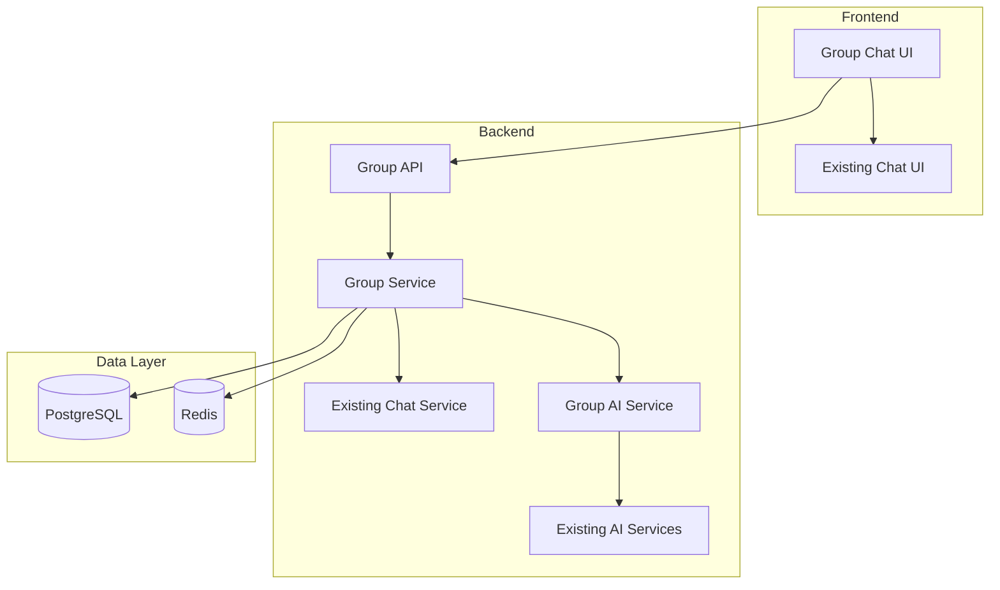

# Group Chat Design Document

## Overview

This design extends the existing RetroChat application with group chat functionality. It leverages the existing AI Friend infrastructure to create Group AI Members that learn from and mimic the collective chat style of group participants.

## Architecture

### Integration with Existing System

The group chat feature integrates with the existing RetroChat architecture:



### Key Design Decisions

1. **Reuse Existing AI Infrastructure**: The `AIStyleAnalysisService` will be reused for group style analysis
2. **Extend Message System**: Group messages use the same WebSocket infrastructure as 1-on-1 messages
3. **Separate Group AI Profiles**: Each group has its own AI profile, independent of individual user AI Friends
4. **Redis for Real-time**: Use Redis to track which users are viewing which groups for typing indicators

## Components and Interfaces

### Backend Services

#### 1. Group Service

```typescript
interface GroupService {
  createGroup(
    creatorId: string,
    name: string,
    description: string,
    memberIds: string[]
  ): Promise<Group>;
  getGroup(groupId: string): Promise<Group>;
  getUserGroups(userId: string): Promise<Group[]>;
  addMember(groupId: string, userId: string, addedBy: string): Promise<void>;
  removeMember(groupId: string, userId: string, removedBy: string): Promise<void>;
  leaveGroup(groupId: string, userId: string): Promise<void>;
  updateGroup(groupId: string, updates: GroupUpdate): Promise<Group>;
  deleteGroup(groupId: string, deletedBy: string): Promise<void>;
  isUserInGroup(groupId: string, userId: string): Promise<boolean>;
  isUserAdmin(groupId: string, userId: string): Promise<boolean>;
}
```

#### 2. Group Message Service

```typescript
interface GroupMessageService {
  sendGroupMessage(
    groupId: string,
    fromUserId: string,
    content: string,
    isAIGenerated: boolean
  ): Promise<GroupMessage>;
  getGroupMessages(groupId: string, limit: number, before?: Date): Promise<GroupMessage[]>;
  markGroupMessagesAsRead(groupId: string, userId: string): Promise<void>;
  getUnreadGroupMessageCount(userId: string): Promise<number>;
}
```

#### 3. Group AI Service

```typescript
interface GroupAIService {
  analyzeGroupStyle(groupId: string): Promise<GroupStyleProfile>;
  generateGroupAIResponse(
    groupId: string,
    userMessage: string,
    mentionedBy: string
  ): Promise<string>;
  generateGroupAIResponseStream(
    groupId: string,
    userMessage: string,
    mentionedBy: string
  ): AsyncGenerator<string>;
  getGroupStyleProfile(groupId: string): Promise<GroupStyleProfile>;
  resetGroupStyleProfile(groupId: string): Promise<void>;
  hasMinimumData(groupId: string): Promise<boolean>;
  shouldUpdateProfile(groupId: string): Promise<boolean>;
}
```

#### 4. WebSocket Events (Extended)

```typescript
// Client -> Server
interface GroupClientEvents {
  "group:message:send": (payload: { groupId: string; content: string }) => void;
  "group:typing": (payload: { groupId: string }) => void;
  "group:ai:mention": (payload: { groupId: string; content: string }) => void;
}

// Server -> Client
interface GroupServerEvents {
  "group:message:receive": (message: GroupMessage) => void;
  "group:typing": (payload: { groupId: string; userId: string; username: string }) => void;
  "group:member:added": (payload: { groupId: string; member: User }) => void;
  "group:member:removed": (payload: { groupId: string; userId: string }) => void;
  "group:ai:stream-start": (payload: { groupId: string; messageId: string }) => void;
  "group:ai:stream-chunk": (payload: {
    groupId: string;
    chunk: string;
    fullResponse: string;
  }) => void;
  "group:ai:stream-end": (payload: { groupId: string; message: GroupMessage }) => void;
}
```

## Data Models

### Group

```typescript
interface Group {
  id: string;
  name: string;
  description: string | null;
  createdBy: string;
  createdAt: Date;
  updatedAt: Date;
  aiEnabled: boolean;
}
```

### GroupMember

```typescript
interface GroupMember {
  id: string;
  groupId: string;
  userId: string;
  isAdmin: boolean;
  joinedAt: Date;
  notificationsMuted: boolean;
}
```

### GroupMessage

```typescript
interface GroupMessage {
  id: string;
  groupId: string;
  fromUserId: string;
  content: string;
  timestamp: Date;
  isAIGenerated: boolean;
  mentionedUserIds: string[];
}
```

### GroupMessageRead

```typescript
interface GroupMessageRead {
  id: string;
  groupMessageId: string;
  userId: string;
  readAt: Date;
}
```

### GroupStyleProfile

```typescript
interface GroupStyleProfile {
  groupId: string;
  messageCount: number;
  memberContributions: Record<string, number>; // userId -> message count
  commonPhrases: string[];
  emojiUsage: Record<string, number>;
  averageMessageLength: number;
  toneIndicators: {
    casual: number;
    formal: number;
    enthusiastic: number;
  };
  stylePrompt: string;
  lastUpdated: Date;
}
```

### Database Schema (Drizzle ORM)

```typescript
import {
  pgTable,
  text,
  timestamp,
  boolean,
  integer,
  jsonb,
  uuid,
  index,
} from "drizzle-orm/pg-core";

// Groups table
export const groups = pgTable("groups", {
  id: uuid("id").primaryKey().defaultRandom(),
  name: text("name").notNull(),
  description: text("description"),
  createdBy: text("created_by")
    .notNull()
    .references(() => user.id, { onDelete: "cascade" }),
  createdAt: timestamp("created_at").defaultNow().notNull(),
  updatedAt: timestamp("updated_at")
    .defaultNow()
    .$onUpdate(() => new Date())
    .notNull(),
  aiEnabled: boolean("ai_enabled").default(true).notNull(),
});

// Group members table
export const groupMembers = pgTable(
  "group_members",
  {
    id: uuid("id").primaryKey().defaultRandom(),
    groupId: uuid("group_id")
      .notNull()
      .references(() => groups.id, { onDelete: "cascade" }),
    userId: text("user_id")
      .notNull()
      .references(() => user.id, { onDelete: "cascade" }),
    isAdmin: boolean("is_admin").default(false).notNull(),
    joinedAt: timestamp("joined_at").defaultNow().notNull(),
    notificationsMuted: boolean("notifications_muted").default(false).notNull(),
  },
  (table) => ({
    groupUserIdx: index("idx_group_members_group_user").on(table.groupId, table.userId),
    userIdx: index("idx_group_members_user").on(table.userId),
  })
);

// Group messages table
export const groupMessages = pgTable(
  "group_messages",
  {
    id: uuid("id").primaryKey().defaultRandom(),
    groupId: uuid("group_id")
      .notNull()
      .references(() => groups.id, { onDelete: "cascade" }),
    fromUserId: text("from_user_id")
      .notNull()
      .references(() => user.id, { onDelete: "cascade" }),
    content: text("content").notNull(),
    timestamp: timestamp("timestamp").defaultNow().notNull(),
    isAIGenerated: boolean("is_ai_generated").default(false).notNull(),
    mentionedUserIds: jsonb("mentioned_user_ids").$type<string[]>().default([]),
  },
  (table) => ({
    groupIdx: index("idx_group_messages_group").on(table.groupId),
    timestampIdx: index("idx_group_messages_timestamp").on(table.timestamp),
  })
);

// Group message read status table
export const groupMessageReads = pgTable(
  "group_message_reads",
  {
    id: uuid("id").primaryKey().defaultRandom(),
    groupMessageId: uuid("group_message_id")
      .notNull()
      .references(() => groupMessages.id, { onDelete: "cascade" }),
    userId: text("user_id")
      .notNull()
      .references(() => user.id, { onDelete: "cascade" }),
    readAt: timestamp("read_at").defaultNow().notNull(),
  },
  (table) => ({
    messageUserIdx: index("idx_group_message_reads_message_user").on(
      table.groupMessageId,
      table.userId
    ),
  })
);

// Group style profiles table
export const groupStyleProfiles = pgTable("group_style_profiles", {
  groupId: uuid("group_id")
    .primaryKey()
    .references(() => groups.id, { onDelete: "cascade" }),
  messageCount: integer("message_count").default(0).notNull(),
  memberContributions: jsonb("member_contributions").$type<Record<string, number>>().default({}),
  commonPhrases: jsonb("common_phrases").$type<string[]>().default([]),
  emojiUsage: jsonb("emoji_usage").$type<Record<string, number>>().default({}),
  averageMessageLength: integer("average_message_length").default(0),
  toneIndicators: jsonb("tone_indicators")
    .$type<{
      casual: number;
      formal: number;
      enthusiastic: number;
    }>()
    .default({ casual: 0, formal: 0, enthusiastic: 0 }),
  stylePrompt: text("style_prompt"),
  lastUpdated: timestamp("last_updated").defaultNow().notNull(),
});
```

## Group AI Implementation

### Differences from Individual AI Friend

1. **Collective Style Analysis**: Analyzes messages from all group members, not just one user
2. **Weighted Contributions**: Can weight active members more heavily in style analysis
3. **Higher Message Threshold**: Requires 100 messages (vs 50 for individual) for better group representation
4. **Update Frequency**: Updates every 20 messages (vs 10 for individual) to reduce API calls
5. **Mention-based Activation**: Group AI responds when mentioned, not to every message

### Group Style Prompt Generation

```typescript
function generateGroupStylePrompt(profile: GroupStyleProfile, members: User[]): string {
  const parts: string[] = [];

  parts.push(
    "You are an AI member of a group chat. You should mimic the collective chat style of the group members."
  );
  parts.push("");
  parts.push(
    `Group has ${members.length} members: ${members.map((m) => m.displayName).join(", ")}`
  );
  parts.push("");

  // Common phrases
  if (profile.commonPhrases.length > 0) {
    parts.push(`Common group phrases: ${profile.commonPhrases.join(", ")}`);
  }

  // Emoji usage
  const topEmojis = Object.entries(profile.emojiUsage)
    .slice(0, 10)
    .map(([emoji, count]) => `${emoji} (${count} times)`);
  if (topEmojis.length > 0) {
    parts.push(`Frequently used emojis: ${topEmojis.join(", ")}`);
  }

  // Message length
  parts.push(`Average message length: ${profile.averageMessageLength} characters`);

  // Tone
  const toneDescriptions: string[] = [];
  if (profile.toneIndicators.casual > 30) {
    toneDescriptions.push(`${profile.toneIndicators.casual}% casual`);
  }
  if (profile.toneIndicators.formal > 30) {
    toneDescriptions.push(`${profile.toneIndicators.formal}% formal`);
  }
  if (profile.toneIndicators.enthusiastic > 30) {
    toneDescriptions.push(`${profile.toneIndicators.enthusiastic}% enthusiastic`);
  }
  if (toneDescriptions.length > 0) {
    parts.push(`Group tone: ${toneDescriptions.join(", ")}`);
  }

  parts.push("");
  parts.push(
    "Respond naturally as a member of this group, reflecting the group's collective style."
  );

  return parts.join("\n");
}
```

### Group AI Member Initialization

Each group automatically gets an AI member with a special user ID pattern: `group-ai-{groupId}`

```typescript
async function createGroupAIMember(groupId: string): Promise<void> {
  const aiUserId = `group-ai-${groupId}`;

  // Create AI user if doesn't exist
  await db.insert(user).values({
    id: aiUserId,
    name: "Group AI",
    email: `group-ai-${groupId}@retrochat.app`,
    emailVerified: true,
  });

  // Create AI profile
  await db.insert(userProfile).values({
    userId: aiUserId,
    username: `group-ai-${groupId}`,
    displayName: "🤖 Group AI",
    statusMessage: "Learning from the group!",
  });

  // Add AI as group member
  await db.insert(groupMembers).values({
    groupId,
    userId: aiUserId,
    isAdmin: false,
  });
}
```

## API Endpoints

### Group Management

- `POST /api/groups` - Create a new group
- `GET /api/groups` - Get user's groups
- `GET /api/groups/:groupId` - Get group details
- `PATCH /api/groups/:groupId` - Update group (admin only)
- `DELETE /api/groups/:groupId` - Delete group (admin only)
- `POST /api/groups/:groupId/members` - Add member (admin only)
- `DELETE /api/groups/:groupId/members/:userId` - Remove member (admin only)
- `POST /api/groups/:groupId/leave` - Leave group

### Group Messages

- `GET /api/groups/:groupId/messages` - Get group messages
- `POST /api/groups/:groupId/messages/read` - Mark messages as read
- `GET /api/groups/unread` - Get unread group message count

### Group AI

- `GET /api/groups/:groupId/ai/profile` - Get group AI style profile
- `POST /api/groups/:groupId/ai/reset` - Reset group AI style (admin only)
- `PATCH /api/groups/:groupId/ai/toggle` - Enable/disable group AI (admin only)

## Error Handling

### Group-Specific Errors

- `GROUP_NOT_FOUND`: Group doesn't exist
- `NOT_GROUP_MEMBER`: User is not a member of the group
- `NOT_GROUP_ADMIN`: User is not an admin of the group
- `CANNOT_REMOVE_LAST_ADMIN`: Cannot remove the last admin
- `GROUP_NAME_REQUIRED`: Group name is required
- `INVALID_MEMBER_COUNT`: Groups must have at least 3 members
- `GROUP_AI_INSUFFICIENT_DATA`: Group AI needs more messages to learn

## Testing Strategy

### Unit Tests

- Group service methods (create, add/remove members, delete)
- Group AI style analysis with multiple users
- Group message service methods
- Permission checks (admin vs member)

### Integration Tests

- Group creation and member management flow
- Group messaging with WebSocket
- Group AI mention and response
- Group AI style profile updates

### End-to-End Tests

- Create group, add members, send messages
- Group AI interaction and streaming
- Admin actions (remove member, delete group)
- Leave group and admin transfer

## Security Considerations

1. **Authorization**: Verify user is group member before allowing access
2. **Admin Permissions**: Verify admin status for privileged operations
3. **Message Privacy**: Only group members can see group messages
4. **Rate Limiting**: Limit group creation to 10 per user per day
5. **Input Validation**: Sanitize group names, descriptions, and messages
6. **AI Safety**: Monitor Group AI responses for inappropriate content

## Performance Considerations

1. **Message Pagination**: Load messages in batches of 50
2. **Member Caching**: Cache group member lists in Redis
3. **Typing Indicators**: Use Redis pub/sub for efficient broadcasting
4. **AI Updates**: Batch style profile updates to reduce database writes
5. **Unread Counts**: Use Redis counters for fast unread message counts

## Migration Strategy

Since this is a new feature, no data migration is needed. The new tables will be created alongside existing tables without affecting current functionality.
