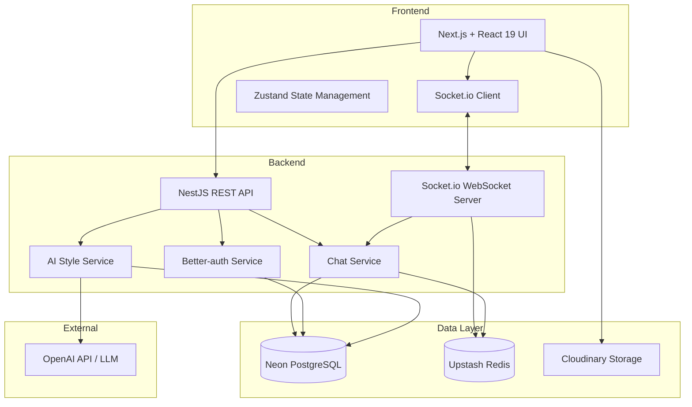

# RetroChat Design Document

## Overview

RetroChat is a full-stack web application that recreates the MSN Messenger experience with modern AI capabilities. The system consists of a React-based frontend with retro styling, a Node.js/Express backend with WebSocket support for real-time messaging, and an AI service that analyzes and mimics user chat styles.

## Architecture

### High-Level Architecture



### Technology Stack

**Frontend:**

- React 19 with Next.js (latest) and TypeScript
- Zustand for state management
- Socket.io-client for WebSocket connections
- Tailwind CSS with retro MSN Messenger styling
- Better-auth for authentication
- Cloudinary for file storage (profile pictures)

**Backend:**

- NestJS with TypeScript
- Drizzle ORM for database operations
- Socket.io for WebSocket server
- Neon PostgreSQL for persistent data storage
- Upstash Redis for session management and online status
- Better-auth for authentication

**AI Integration:**

- OpenAI API (GPT-4) or similar LLM for chat style mimicry
- Custom prompt engineering for style analysis and generation

## Components and Interfaces

### Frontend Components

#### 1. Authentication Components

- **LoginForm**: Handles user login with username/password
- **RegisterForm**: New user registration with validation
- **ProfileSetup**: Initial profile configuration after registration

#### 2. Main Application Components

- **ContactList**: Displays friends with online status indicators
  - Shows green (online), orange (away), red (offline) status
  - Includes AI Friend as a special contact
  - Search and add friends functionality
- **ChatWindow**: Individual chat conversation interface
  - Message history display
  - Message input with emoticon support
  - Typing indicators
  - Retro MSN styling with customizable themes
- **FriendRequests**: Manages incoming/outgoing friend requests
- **UserProfile**: User settings and profile customization
  - Profile picture upload
  - Status message editing
  - AI Friend management (reset style)

#### 3. Shared Components

- **StatusIndicator**: Visual online status display
- **EmoticonPicker**: Classic MSN emoticon selector
- **NotificationSound**: Audio notification handler

### Backend Services

#### 1. Authentication Service

Better-auth provides built-in authentication with Drizzle adapter integration:

```typescript
// Auth server config
import { betterAuth } from "better-auth";
import { drizzleAdapter } from "better-auth/adapters/drizzle";
import { db } from "../db";

export const auth = betterAuth({
  database: drizzleAdapter(db, {
    provider: "pg",
  }),
});
```

Better-auth automatically provides:

- User registration with email/password
- User login and session management
- Email verification
- Social login support (optional)
- Session token management
- Password hashing and security

NestJS module setup:

```typescript
import { Module } from "@nestjs/common";
import { AuthModule } from "@thallesp/nestjs-better-auth";
import { auth } from "./lib/auth";

@Module({
  imports: [AuthModule.forRoot(auth)],
  // ... other modules
})
export class AppModule {}
```

#### 2. Chat Service

```typescript
interface ChatService {
  sendMessage(fromUserId: string, toUserId: string, content: string): Promise<Message>;
  getConversation(userId1: string, userId2: string, limit: number): Promise<Message[]>;
  markAsRead(messageId: string): Promise<void>;
  getUnreadCount(userId: string): Promise<number>;
}
```

#### 3. User Service

```typescript
interface UserService {
  getUserById(userId: string): Promise<User>;
  searchUsers(query: string): Promise<User[]>;
  updateProfile(userId: string, updates: ProfileUpdate): Promise<User>;
  getContacts(userId: string): Promise<User[]>;
  sendFriendRequest(fromUserId: string, toUserId: string): Promise<FriendRequest>;
  acceptFriendRequest(requestId: string): Promise<void>;
}
```

#### 4. AI Style Service

```typescript
interface AIStyleService {
  analyzeMessages(userId: string, messages: Message[]): Promise<StyleProfile>;
  generateResponse(userId: string, userMessage: string): Promise<string>;
  getStyleProfile(userId: string): Promise<StyleProfile>;
  resetStyleProfile(userId: string): Promise<void>;
  hasMinimumData(userId: string): Promise<boolean>;
}
```

#### 5. WebSocket Events

```typescript
// Client -> Server
interface ClientEvents {
  "user:online": (userId: string) => void;
  "user:typing": (toUserId: string) => void;
  "message:send": (message: MessagePayload) => void;
}

// Server -> Client
interface ServerEvents {
  "user:status": (userId: string, status: "online" | "away" | "offline") => void;
  "user:typing": (fromUserId: string) => void;
  "message:receive": (message: Message) => void;
  "friend:request": (request: FriendRequest) => void;
}
```

## Data Models

### User (Better-auth Schema)

```typescript
// Better-auth user schema (required)
export const user = pgTable("user", {
  id: text("id").primaryKey(),
  name: text("name").notNull(),
  email: text("email").notNull().unique(),
  emailVerified: boolean("email_verified").default(false).notNull(),
  image: text("image"),
  createdAt: timestamp("created_at").defaultNow().notNull(),
  updatedAt: timestamp("updated_at")
    .defaultNow()
    .$onUpdate(() => new Date())
    .notNull(),
});

// Extended user profile (RetroChat specific)
export const userProfile = pgTable("user_profile", {
  userId: text("user_id")
    .primaryKey()
    .references(() => user.id, { onDelete: "cascade" }),
  username: text("username").unique().notNull(),
  displayName: text("display_name").notNull(),
  statusMessage: text("status_message"),
  profilePictureUrl: text("profile_picture_url"),
});

// Better-auth session schema (required)
export const session = pgTable("session", {
  id: text("id").primaryKey(),
  expiresAt: timestamp("expires_at").notNull(),
  token: text("token").notNull().unique(),
  createdAt: timestamp("created_at").defaultNow().notNull(),
  updatedAt: timestamp("updated_at")
    .$onUpdate(() => new Date())
    .notNull(),
  ipAddress: text("ip_address"),
  userAgent: text("user_agent"),
  userId: text("user_id")
    .notNull()
    .references(() => user.id, { onDelete: "cascade" }),
});

// Better-auth account schema (required)
export const account = pgTable("account", {
  id: text("id").primaryKey(),
  accountId: text("account_id").notNull(),
  providerId: text("provider_id").notNull(),
  userId: text("user_id")
    .notNull()
    .references(() => user.id, { onDelete: "cascade" }),
  accessToken: text("access_token"),
  refreshToken: text("refresh_token"),
  idToken: text("id_token"),
  accessTokenExpiresAt: timestamp("access_token_expires_at"),
  refreshTokenExpiresAt: timestamp("refresh_token_expires_at"),
  scope: text("scope"),
  password: text("password"),
  createdAt: timestamp("created_at").defaultNow().notNull(),
  updatedAt: timestamp("updated_at")
    .$onUpdate(() => new Date())
    .notNull(),
});

// Better-auth verification schema (required)
export const verification = pgTable("verification", {
  id: text("id").primaryKey(),
  identifier: text("identifier").notNull(),
  value: text("value").notNull(),
  expiresAt: timestamp("expires_at").notNull(),
  createdAt: timestamp("created_at").defaultNow().notNull(),
  updatedAt: timestamp("updated_at")
    .defaultNow()
    .$onUpdate(() => new Date())
    .notNull(),
});
```

### Message

```typescript
interface Message {
  id: string;
  fromUserId: string;
  toUserId: string;
  content: string;
  timestamp: Date;
  isRead: boolean;
  isAIGenerated: boolean;
}
```

### FriendRequest

```typescript
interface FriendRequest {
  id: string;
  fromUserId: string;
  toUserId: string;
  status: "pending" | "accepted" | "rejected";
  createdAt: Date;
}
```

### Friendship

```typescript
interface Friendship {
  id: string;
  userId1: string;
  userId2: string;
  createdAt: Date;
}
```

### StyleProfile

```typescript
interface StyleProfile {
  userId: string;
  messageCount: number;
  commonPhrases: string[];
  emojiUsage: Record<string, number>;
  averageMessageLength: number;
  toneIndicators: {
    casual: number;
    formal: number;
    enthusiastic: number;
  };
  lastUpdated: Date;
  stylePrompt: string; // Generated prompt for LLM
}
```

### Database Schema (Drizzle ORM)

```typescript
import {
  pgTable,
  text,
  timestamp,
  boolean,
  integer,
  real,
  jsonb,
  uuid,
  index,
} from "drizzle-orm/pg-core";

// Messages table
export const messages = pgTable(
  "messages",
  {
    id: uuid("id").primaryKey().defaultRandom(),
    fromUserId: text("from_user_id")
      .notNull()
      .references(() => user.id, { onDelete: "cascade" }),
    toUserId: text("to_user_id")
      .notNull()
      .references(() => user.id, { onDelete: "cascade" }),
    content: text("content").notNull(),
    timestamp: timestamp("timestamp").defaultNow().notNull(),
    isRead: boolean("is_read").default(false).notNull(),
    isAIGenerated: boolean("is_ai_generated").default(false).notNull(),
  },
  (table) => ({
    usersIdx: index("idx_messages_users").on(table.fromUserId, table.toUserId),
    timestampIdx: index("idx_messages_timestamp").on(table.timestamp),
  })
);

// Friendships table
export const friendships = pgTable(
  "friendships",
  {
    id: uuid("id").primaryKey().defaultRandom(),
    userId1: text("user_id_1")
      .notNull()
      .references(() => user.id, { onDelete: "cascade" }),
    userId2: text("user_id_2")
      .notNull()
      .references(() => user.id, { onDelete: "cascade" }),
    createdAt: timestamp("created_at").defaultNow().notNull(),
  },
  (table) => ({
    usersIdx: index("idx_friendships_users").on(table.userId1, table.userId2),
  })
);

// Friend requests table
export const friendRequests = pgTable("friend_requests", {
  id: uuid("id").primaryKey().defaultRandom(),
  fromUserId: text("from_user_id")
    .notNull()
    .references(() => user.id, { onDelete: "cascade" }),
  toUserId: text("to_user_id")
    .notNull()
    .references(() => user.id, { onDelete: "cascade" }),
  status: text("status", { enum: ["pending", "accepted", "rejected"] })
    .default("pending")
    .notNull(),
  createdAt: timestamp("created_at").defaultNow().notNull(),
});

// Style profiles table
export const styleProfiles = pgTable("style_profiles", {
  userId: text("user_id")
    .primaryKey()
    .references(() => user.id, { onDelete: "cascade" }),
  messageCount: integer("message_count").default(0).notNull(),
  commonPhrases: jsonb("common_phrases").$type<string[]>(),
  emojiUsage: jsonb("emoji_usage").$type<Record<string, number>>(),
  averageMessageLength: real("average_message_length"),
  toneIndicators: jsonb("tone_indicators").$type<{
    casual: number;
    formal: number;
    enthusiastic: number;
  }>(),
  stylePrompt: text("style_prompt"),
  lastUpdated: timestamp("last_updated").defaultNow().notNull(),
});
```

## AI Style Mimicry Implementation

### Style Analysis Process

1. **Data Collection**: Collect user's messages (minimum 50 messages)
2. **Pattern Extraction**:
   - Tokenize messages and identify frequent phrases
   - Analyze emoji and emoticon usage patterns
   - Calculate average message length and sentence structure
   - Detect tone through sentiment analysis
3. **Profile Generation**: Create a style prompt for the LLM
4. **Continuous Learning**: Update profile every 10 messages

### Style Prompt Template

```
You are mimicking the chat style of a user. Here are their characteristics:

Common phrases: [list of phrases]
Emoji usage: [emoji patterns]
Average message length: [length]
Tone: [casual/formal/enthusiastic percentages]
Typical sentence structure: [patterns]

Respond to the following message in this user's style, keeping the response natural and conversational:
[user message]
```

### AI Friend Response Flow

1. User sends message to AI Friend
2. System retrieves user's StyleProfile
3. If messageCount < 50: Return "I'm still learning your style! Chat with me more."
4. Otherwise: Generate prompt with style characteristics
5. Call LLM API with prompt
6. Return generated response
7. Store message in database with isAIGenerated = true

## Error Handling

### Frontend Error Handling

- Network errors: Display retry button with user-friendly message
- WebSocket disconnection: Automatic reconnection with exponential backoff
- Form validation: Real-time validation with clear error messages
- API errors: Toast notifications with error details

### Backend Error Handling

- Authentication errors: Return 401 with clear error message
- Validation errors: Return 400 with field-specific errors
- Database errors: Log error, return 500 with generic message
- AI API errors: Fallback to generic response, log for monitoring
- Rate limiting: 429 response with retry-after header

### Error Response Format

```typescript
interface ErrorResponse {
  error: {
    code: string;
    message: string;
    details?: any;
  };
}
```

## Testing Strategy

### Unit Tests

- Service layer functions (chat, AI style analysis)
- Utility functions and helpers
- React component logic
- Zustand store actions and state updates

### Integration Tests

- API endpoints with database interactions
- WebSocket event handling
- Authentication flow
- Friend request workflow
- Message sending and receiving

### End-to-End Tests

- User registration and login flow
- Adding friends and accepting requests
- Sending messages between users
- AI Friend conversation flow
- Profile updates

### Performance Testing

- WebSocket connection handling under load
- Database query performance with large message history
- AI response time monitoring
- Concurrent user sessions

## Security Considerations

1. **Authentication & Session Management**: Handled by Better-auth with Drizzle adapter
   - Automatic session token management with secure expiration
   - Password hashing with industry-standard algorithms
   - Email verification support
   - HTTP-only cookies for session tokens
2. **Transport Security**: TLS 1.3 for all connections
3. **Input Validation**: Sanitize all user inputs to prevent XSS
4. **SQL Injection Prevention**: Drizzle ORM provides parameterized queries by default
5. **Rate Limiting**: Limit API requests to 100/minute per user
6. **CORS**: Restrict to frontend domain only
7. **Data Privacy**: Users can only access their own messages and AI profile
8. **Environment Variables**: Store sensitive keys (OpenAI API, Cloudinary, database URLs) in environment variables

## Deployment Architecture

Simple deployment strategy using managed services:

- **Frontend**: Vercel (Next.js optimized hosting with automatic deployments)
- **Backend**: Vercel (NestJS deployed as serverless functions)
- **Database**: Neon PostgreSQL (serverless Postgres with automatic scaling)
- **Cache**: Upstash Redis (serverless Redis for session management)
- **File Storage**: Cloudinary (profile pictures and media)
- **WebSocket**: Vercel supports WebSocket connections for real-time features
- **Environment Variables**: Managed through Vercel dashboard
- **Monitoring**: Vercel Analytics and logging
